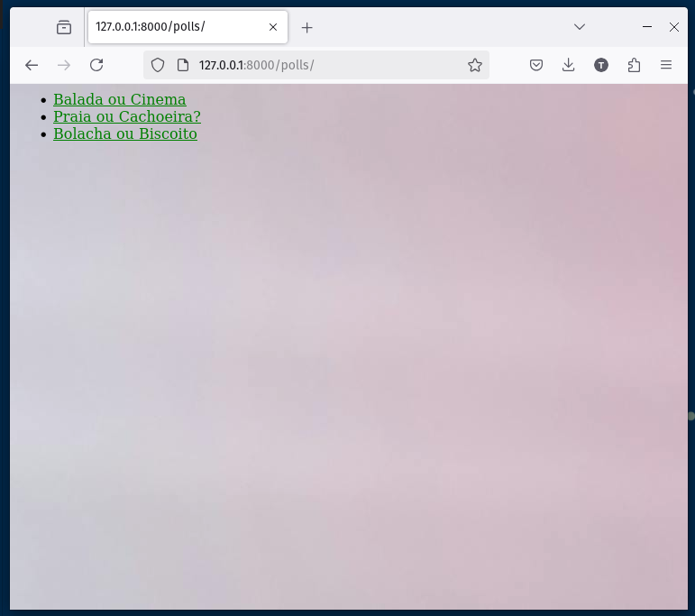
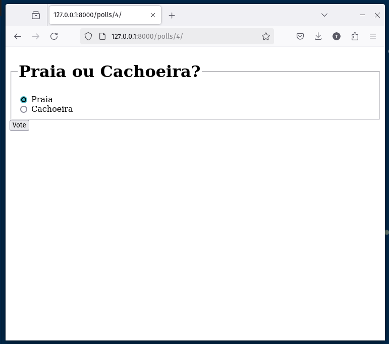
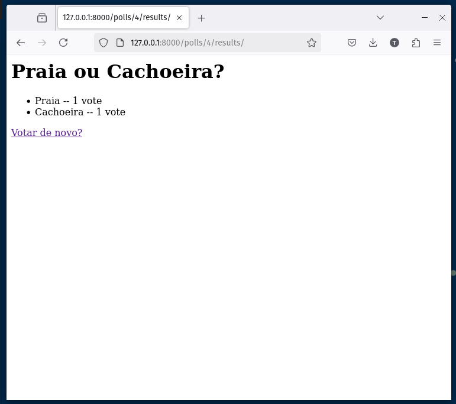
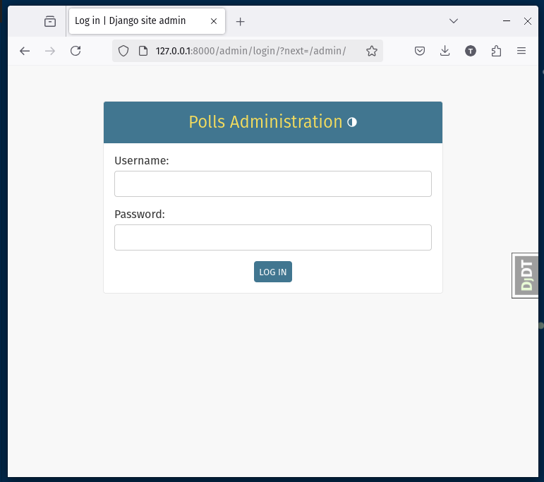
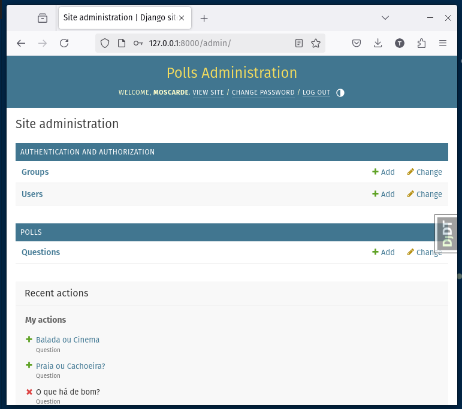
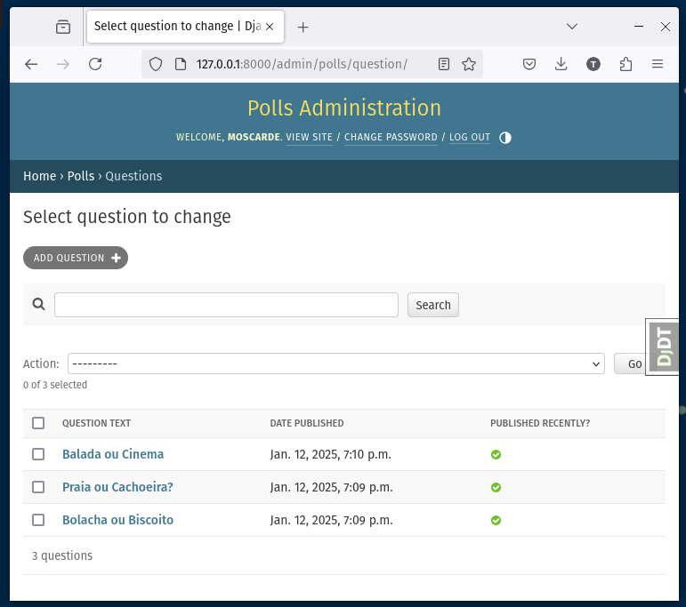
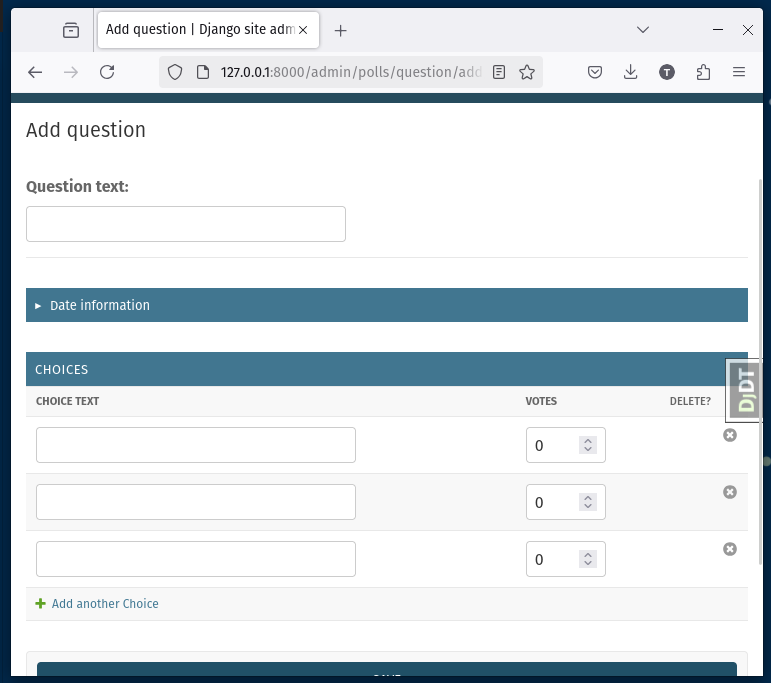
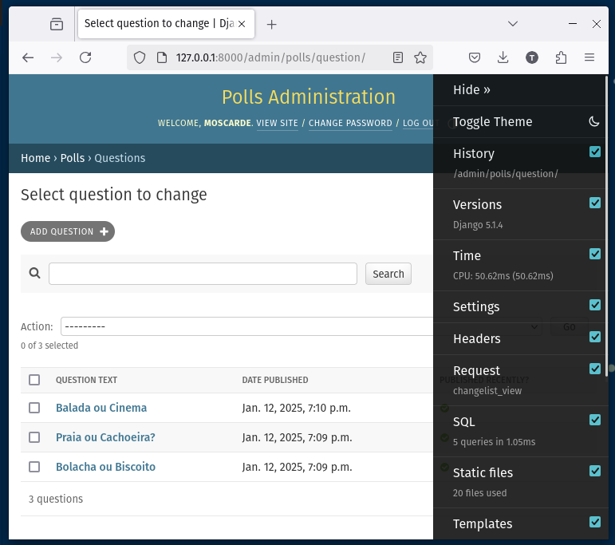

# Django Tutorial

Este projeto tem como objetivo explorar o framework Django, seguindo o tutorial oficial disponibilizado na documentação. Durante o processo, foram feitas anotações sobre as funcionalidades e melhores práticas do Django, além de experimentações práticas para consolidar o aprendizado.

Para mais informações e detalhes sobre o Django, você pode acessar a [documentação oficial do Django](https://www.djangoproject.com/).

## Screenshots

|  |  |  |
| --- | --- | --- |
|  |  |  |
|  |  | |

## Índice de anotações por páginas da documentação

1. [Página 1: Introdução ao Django e Primeiros Passos](#página-1-introdução-ao-django-e-primeiros-passos)
2. [Página 2: Configuração do Banco de Dados e Criação de Models](#página-2-configuração-do-banco-de-dados-e-criação-de-modelos)
3. [Página 3: Visão Geral de Views, URLs e Templates](#página-3-visão-geral-de-views-urls-e-templates)
4. [Página 4: Criando um Formulário Simples](#página-4-criando-um-formulário-simples)
5. [Página 5: Testes Automatizados](#página-5-testes-automatizados)
6. [Página 6: Arquivos Estáticos no Django](#página-6-arquivos-estáticos-no-django)
7. [Página 7: Personalize o formulário do site de administração](#página-7-personalize-o-formulário-do-site-de-administração)
8. [Página 8: Instalando apps third-party](#página-8-instalando-apps-third-party)

## Página 1: Introdução ao Django e Primeiros Passos

### Introdução ao Tutorial do Django

- O tutorial guia a criação de uma aplicação básica de enquetes com uma página pública e um site de administração.
- Verifique se o Django está instalado corretamente e se é compatível com a versão do Python.

### Criação de um Projeto Django

- Use `django-admin startproject` para gerar a estrutura inicial do projeto.
- Principais arquivos gerados: `manage.py`, `settings.py`, e `urls.py`.

### Configuração do Servidor de Desenvolvimento

- Inicie o servidor com `python manage.py runserver` e acesse no navegador.
- O servidor recarrega automaticamente em ambiente de desenvolvimento.

### Diferença entre Projetos e Aplicações

- Projetos são coleções de configurações e aplicações, enquanto aplicações são pacotes individuais com funcionalidades específicas.

### Criação da Aplicação de Enquetes

- Use `python manage.py startapp` para gerar a estrutura da aplicação.
- Organize a aplicação em arquivos como `views.py`, `models.py` e `urls.py`.

### Primeira View e Configuração de URLs

- Crie uma view básica com `HttpResponse` e configure a URL no arquivo `urls.py` local.
- Integre `polls.urls` ao projeto global via `include()` no arquivo `mysite/urls.py`.

### Teste da Aplicação

- Acesse a URL `/polls/` no navegador.
- Solucione problemas comuns, como erro de "Página não encontrada".

## Página 2: Configuração do Banco de Dados e Criação de Modelos

### Configuração do Banco de Dados

- O arquivo `settings.py` configura o banco de dados.
- Por padrão, o Django usa SQLite, mas é possível configurar bancos mais robustos como PostgreSQL.
- Ajuste o fuso horário no parâmetro `TIME_ZONE` em `settings.py`.
- A lista de aplicativos instalados está em `INSTALLED_APPS`, que inclui ferramentas como autenticação e sessões.
- Execute `python manage.py migrate` para criar as tabelas no banco de dados.

### Criação de Modelos

- Modelos definem a estrutura de dados, seguindo o princípio DRY.
- Exemplo: `Question` com uma pergunta e data de publicação, `Choice` associada a uma `Question` com texto e contador de votos.
- Relacionamentos como `ForeignKey` podem ser definidos entre modelos.

### Migrações

- Use `python manage.py makemigrations` para registrar alterações nos modelos.
- Execute `python manage.py migrate` para aplicar as alterações no banco de dados.
- Visualize as instruções SQL com `python manage.py sqlmigrate`.

### API do Banco de Dados

- Use o shell interativo `python manage.py shell` para explorar a API de banco de dados e manipular dados diretamente.

### Administrador

- Crie um superusuário com `python manage.py createsuperuser`.
- Inicie o servidor com `python manage.py runserver` e acesse o painel administrativo em [http://127.0.0.1:8000/admin/](http://127.0.0.1:8000/admin/).
- Registre o modelo `Question` em `polls/admin.py` para exibi-lo no Django Admin.

## Página 3: Visão Geral de Views, URLs e Templates

### Objetivo de uma View

- Uma view representa uma página da aplicação Django e é responsável por gerar o conteúdo.
- Exemplo de views: página inicial, detalhes do artigo, resultados de uma enquete.

### Como Django Seleciona a View

- O Django mapeia a URL solicitada para a view correspondente por meio do arquivo `urls.py`.

### Padrões de URL

- URLs são elegantes e mapeadas para views usando URLconf (configuração de URL).

### Escrevendo Views

- Cada view deve retornar um `HttpResponse` ou gerar uma exceção como `Http404`.
- Django permite trabalhar com templates, bancos de dados e outras bibliotecas Python.

### Templates e Views

- Views devem usar templates para separar a lógica de apresentação.
- O sistema de templates do Django facilita a renderização de páginas HTML.

### Tratamento de Erros

- Para objetos não encontrados, a view pode lançar um erro `Http404`.
- Use o atalho `get_object_or_404()` para facilitar esse processo.

### Design do Django

- O design de Django visa manter baixo acoplamento entre as camadas, facilitando a reutilização de código.

## Página 4: Criando um Formulário Simples

### Formulário HTML

- Um formulário para votar em uma enquete é feito com `<form>`, usando `method="post"` para enviar dados e `csrf_token` para segurança.

### View Django

- A view `vote()` manipula a requisição POST, recupera a escolha do usuário e incrementa os votos.
- Caso a escolha não seja feita, exibe uma mensagem de erro e reexibe a página.

### Redirecionamento e Reverse

- Use `HttpResponseRedirect` para redirecionar para a página de resultados após a submissão.
- A URL da página de resultados pode ser gerada com `reverse()`, evitando codificar URLs diretamente.

### Views Genéricas

- Django oferece views genéricas como `ListView` e `DetailView` para exibir listas ou detalhes de objetos, evitando código repetitivo.

### Refatoração do URLconf

- Refatore `detail()` e `results()` para usar views genéricas e atualize o `urls.py` para usar a variável `<pk>` no lugar de `<question_id>`.

## Página 5: Testes Automatizados

### O que são Testes Automatizados?

- Testes verificam o funcionamento do código automaticamente, sem intervenção manual.
- Previnem problemas e tornam o código mais robusto e confiável.

### Por que Criar Testes?

- Economizam tempo, evitam testes manuais repetitivos e garantem que mudanças no código não quebrem funcionalidades existentes.

### Estratégias Básicas de Testes

- Testes podem ser feitos antes ou depois da implementação do código.
- É importante escrever testes sempre que houver modificações no código.

### Teste de View

- Utilize o Django Test Client para simular interações do usuário e validar o comportamento da aplicação.

## Página 6: Arquivos Estáticos no Django

### Arquivos Estáticos

- Arquivos como imagens, CSS e JavaScript são necessários para renderizar a página web completa.
- O `django.contrib.staticfiles` gerencia esses arquivos em projetos maiores.

### Objetivo do Staticfiles

- Centraliza arquivos estáticos de várias aplicações em um único local para fácil acesso em produção.

## Página 7: Personalize o formulário do site de administração

### Personalização do formulário de administração

- O Django cria um formulário padrão ao registrar um modelo no site de administração.
- É possível personalizar a aparência e o funcionamento do formulário, como reorganizar campos e agrupar se necessário.

### Reorganização de campos

- Usando a opção `fields`, é possível alterar a ordem dos campos no formulário.
- Exemplo: mostrar "Publication date" antes de "Question".

### Divisão do formulário em grupos

- Usando a opção `fieldsets`, pode-se dividir o formulário em seções com títulos, tornando-o mais organizado e intuitivo.
- Isso facilita a navegação e a compreensão do formulário.

### Adicionando objetos relacionados

- Quando há objetos relacionados, como um `Choice` em uma `Question`, é possível registrar o modelo e exibir os campos de ForeignKey no formulário de administração.
- A adição de objetos pode ser feita de forma simples ou mais eficiente utilizando a opção `inline`.

### Uso de `InlineModelAdmin` (StackedInline/TabularInline)

- O uso de `InlineModelAdmin` permite que objetos relacionados sejam exibidos diretamente na página do modelo principal.
- Exemplo: adicionar `Choice` diretamente no formulário da `Question`.
- O `TabularInline` exibe os dados de forma compacta, enquanto o `StackedInline` exibe-os de forma vertical.

### Personalização da página de listagem

- A página "change list" pode ser personalizada com `list_display`, `list_filter` e `search_fields`.
- Com isso, é possível exibir dados específicos, adicionar filtros rápidos e buscar facilmente por informações.

### Capacidade de pesquisa e filtros

- `search_fields` adiciona uma caixa de pesquisa para facilitar a localização de registros.
- `list_filter` permite adicionar filtros rápidos para facilitar a organização dos dados na listagem.

### Personalização do cabeçalho e templates do admin

- É possível alterar o nome do site no cabeçalho de cada página administrativa.
- Também é possível personalizar os templates do Django Admin usando o sistema de templates, criando uma estrutura personalizada para o projeto.

---

## Página 8: Instalando apps third-party

### Objetivo do Django Debug Toolbar

- O Django Debug Toolbar é um pacote de terceiros para depuração de aplicações Django.
- Oferece painéis com informações detalhadas sobre a requisição, resposta, banco de dados, cache, template renderizado, entre outros.
